# 100k UK Used Cars Analysis
  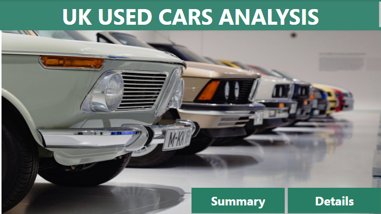

------
## Introduction
This is a Power BI project that conveys analysis of 100k UK Used Cars and the dataset contains information of brand, model, year, price, transmission, mileage, fuel type, tax, miles per gallon (mpg),  and engine size. The dataset housed 13 csv files corresponding to each car manufacturer. 

The purpose of this project is to study the correlation between the features and the target variable, and their significant impact in the selling price of cars

------
## Skills demonstrated
* Data Cleaning & Transformation

* Data Visualization

* DAX and Calculated Measures

* Filters and Tooltips

* Attention to Details

* Problem Solving

-------
## Problem Statement

The objective of this project is to use power BI to visualize the data and answer the following questions and more:

1. What is the average price of each car manufacturer?

2. What is the correlation between the price and mileage of the cars?

3. What is the distribution of fuel types across the dataset?

4. What is the impact of road tax on the price of cars?

5. What is the trend of mileage and price of cars over the years?

6. What is the most commonly used fuel type?

7. What is the average price by transmission?

-------
## Data Sourcing

 The dataset was downloaded from kaggle using the link below

https://www.kaggle.com/datasets/adityadesai13/used-car-dataset-ford-and-mercedes

------
## Data Cleaning/Transformation
The Power BI  folder connector was used to import all the files in a folder at once into the power query editor. I embarked on cleaning the data thoroughly by removing duplicates, nulls, and blanks. I also removed 2 extremely dirty files from the folder since there is a clean version of the 2 brands in the folder. 

I changed the data types, renamed headers and added “ageofcar” Column from “year”. After that, I loaded my data into Power BI. 

#### Cleaned Data
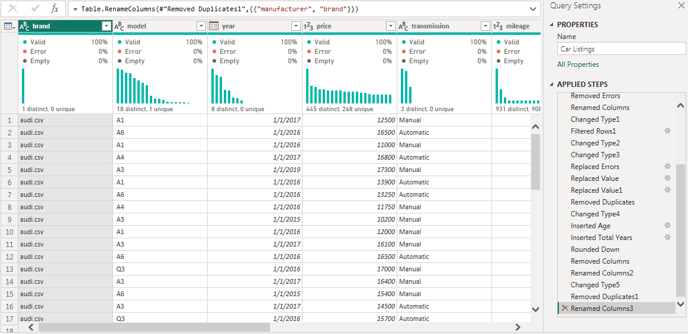

I added 2 extra calculated columns to show the “AvgPricePerModel” & “PricePerMileage”.

#### Calculated Columns
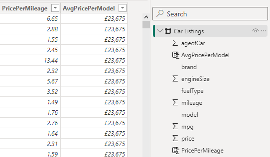

------
## Findings

* There are 11 brands and 195 models in the dataset

* The average price of cars is  £16,863k

* The average mileage is 23,220 miles

* The average age of cars is 7 years

* Mercedes has the highest average price of £25k followed by C Class, Audi, BMW, BW, Skoda, Focus, Hyundi, Toyota, Ford, and Vauxhall with lowest average of  £10k

#### Brands Average Price
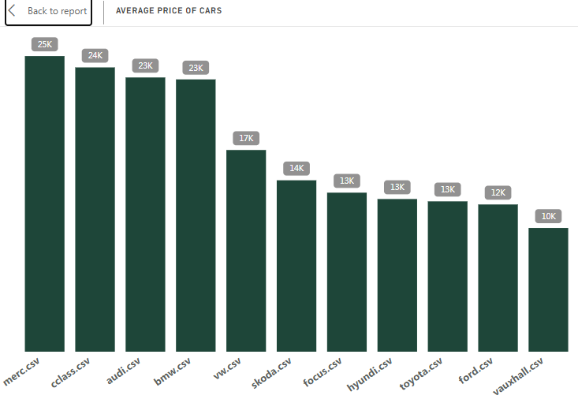

* Petrol is the most used fuel type by 48.85% followed by diesel, hybrid, and others while electronic is the least used fuel type showing extremely low significance in the distribution

#### Fuel Distribution
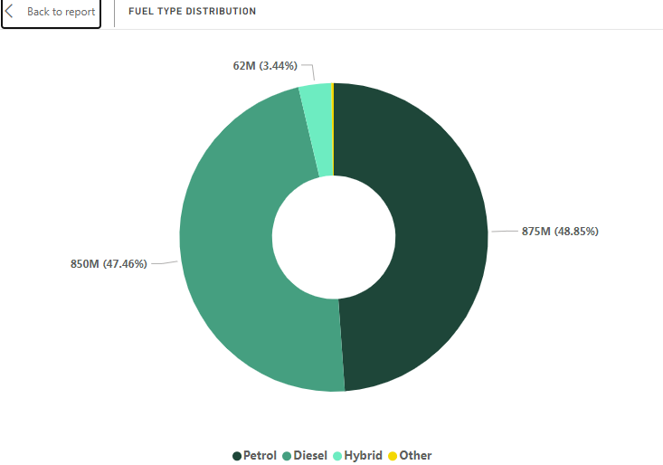

* The scatter plot indicates a positive correlation between price and mileage, that is, as mileage increases, price increases.

#### Mileage and Price
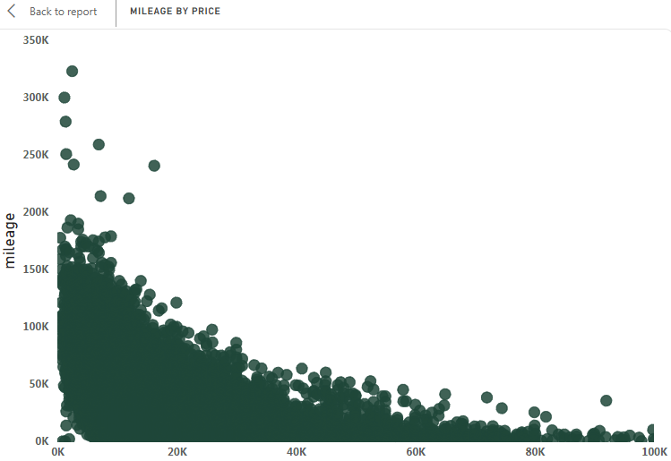

* The relationship between price and road tax is inconsistent as depicted in the line chart and this confirms that road tax does not have any significant impact on the price of cars

#### Price and Tax
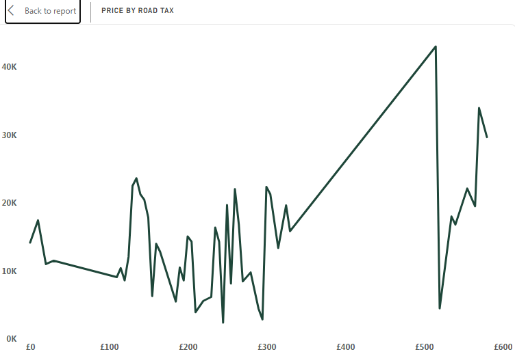

* The price of cars hit its peak in 2019 and declined in 2020, while mileage hit its peak in 2017 and declined in 2020

#### Price and Mileage
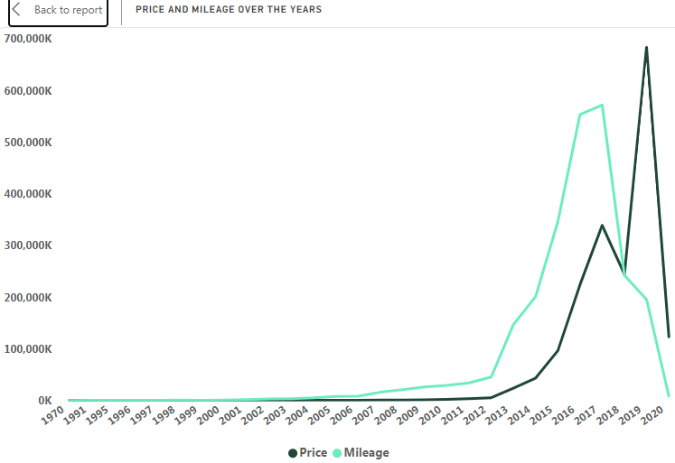

* The top 5 oldest models are M Class, Zafia, C Class, 5 Series, Escort

#### Older Models
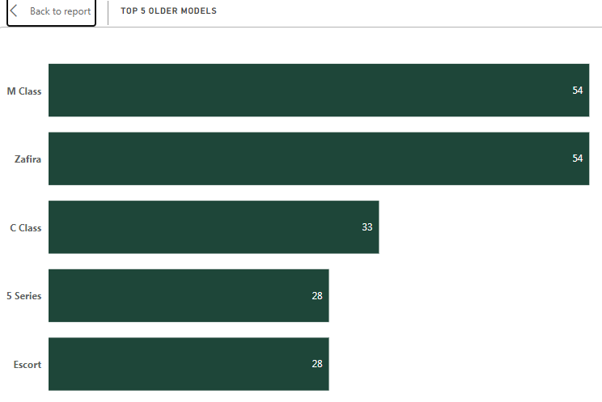

* The top 5 newer models are Camry, Corolla, Fiesta, Hilux, and X Class

#### Newer Models
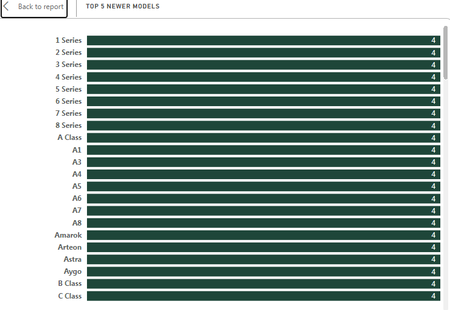

* With recent car inventions, Semi automatic and automatic transmissions are  taking over the manual form of transmission as shown in the chart. Reason being that it has proven to be more convenient and user friendly

This further indicates that transmission has a significant impact in price with semi auto having the highest percentage of price.

#### Transmission
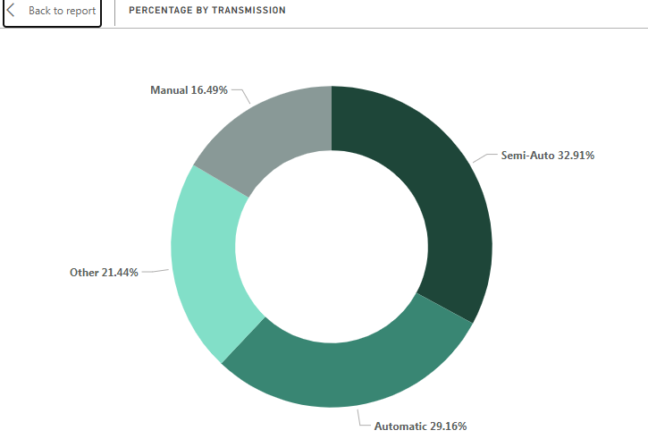

## Visualization
### The report comprises of 3 pages
Welcome Page                             |                             Summary                            |                     Details                                     
:----------------------------------------|----------------------------------------------------------------|----------------------------:
                    |                       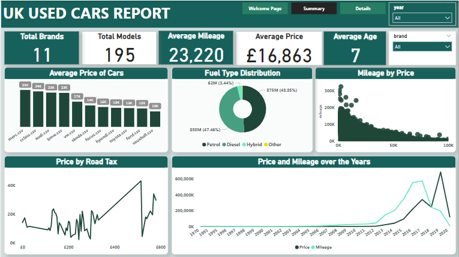                    |        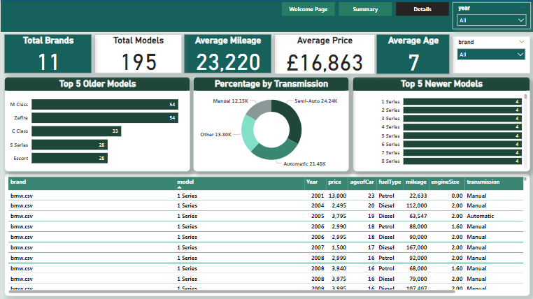 

### You can interact with the report [here](https://app.powerbi.com/groups/me/reports/51648ac4-8355-4d7b-8551-10d768e335f6/ReportSection?experience=power-bi)

-------
## Recommendation

* Sellers should a broader focuse on luxury models like Mercedez, Cclass, Audi, etc., as it has updated technology and yields higher capital for turn over.

* Sellers should ensure consistent availability of cheaper brands like Toyota and Ford because they are more affordable, hence, accessible to a wide range of buyers. These cars typically have lower maintenance, making them more economical to own and operate.

* High budget buyers should consider going for luxury cars like Mercedez, Cclass, Audi, and BMW.

* Lower budget buyers should consider cheaper brands like Toyota, Ford, and Vauxhall for economic balance

_Luxury cars often boast cutting-edge features and technologies that  enhance user experience_.

